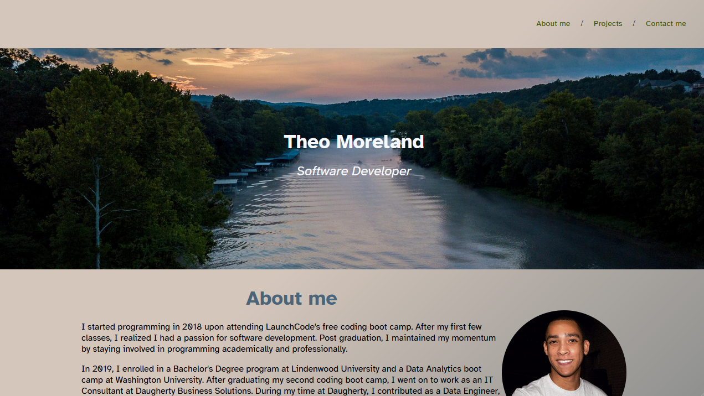

# Portfolio Example

An example of a rudimentary, responsive portfolio website using only HTML and CSS. This is not my actual portfolio, it was intended to function as an example for students of SMU's FSF course (2021).

[View the website live](https://theodoremoreland.github.io/PortfolioExample/)

_Note: This project was an assignment for Southern Methodist University's Full Stack Flex bootcamp (2021)._

## Table of contents

- [Overview](#overview)
- [Technologies used](#technologies-used)
- [How to run](#how-to-run)
- [Screenshots](#screenshots)
  - [Desktop](#desktop)
  - [Mobile](#mobile)

## Overview

This project was a homework assignment near the beginning of Southern Methodist University's Full Stack Flex course (2021). The project was designed to exercise the fundamentals of responsive HTML & CSS in addition to serving as a basis for a project portfolio that can be built upon throughout the course.

The assignment requirements went as follows:

- Displays your name
- Displays a recent photo of yourself or an avatar
- Must have an `About me` section
- Must have a `Previous work` section
  - Presents previously deployed websites or placeholders for future deployments
  - Each website presented on portfolio should have an image and title
  - When you click on a presented website, it should take you to the website
  - The first website featured should have a larger image than the others
- Must have a `Contact info` section
- Website must be deployed to live server
- Website must be responsive using flexbox and media queries
- Project GitHub repository must have a detailed README
  - README has screenshot of website
  - README has description of website
  - README has link to deployed website

## Technologies used

- HTML5
- CSS3
- GitHub Pages
- Text Studio
- Codepen

## Attributions
- [Glitch effect CSS](https://codepen.io/mattgrosswork/pen/VwprebG) from work by Codepen user [Matt Gross](https://codepen.io/mattgrosswork)
- Title and subtitle text effect generated by [Text Studio's Font Generator](https://www.textstudio.com/)

## How to run

1. Clone this repo.
2. Open `index.html` in a web browser.

## Screenshots

### Desktop

#### Hero video

#### About me section

#### Skills section

#### Work experience section

#### Projects section

#### Photos and Socials

### Mobile

#### Hero video

#### About me section

#### Skills section

#### Work experience section

#### Projects section

#### Projects section 2

#### Projects section 3

#### Projects section 4

#### Photos section

#### Photos section 2

#### Photos section 3

#### Socials section

