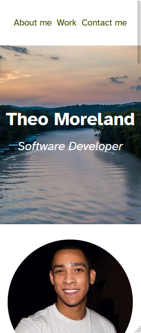
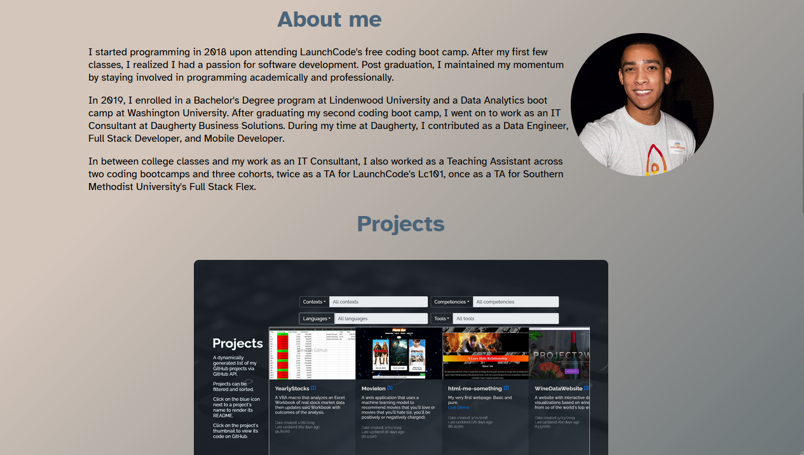
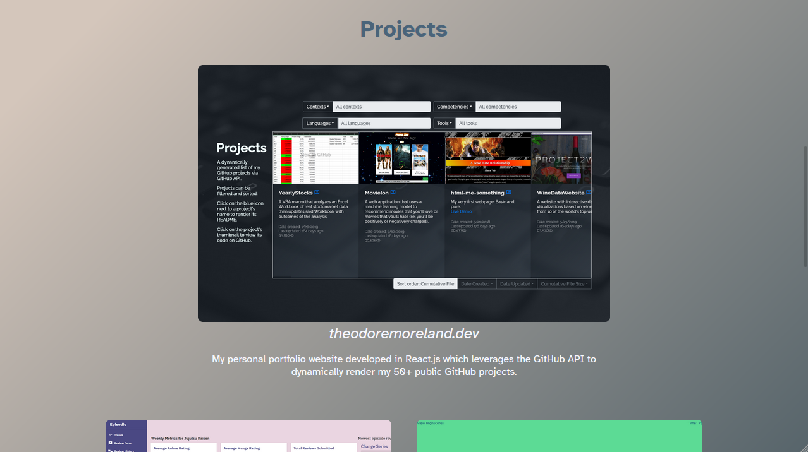
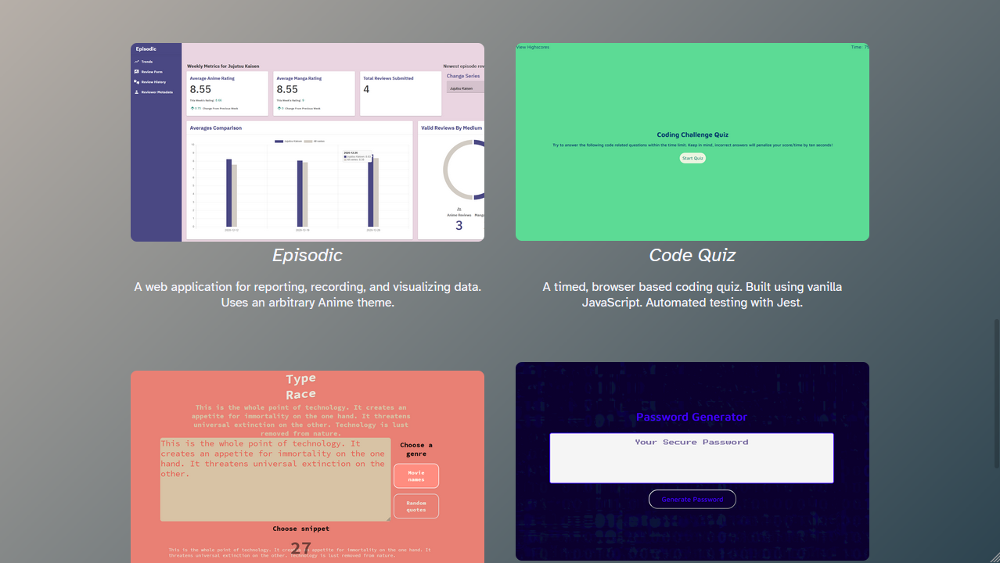
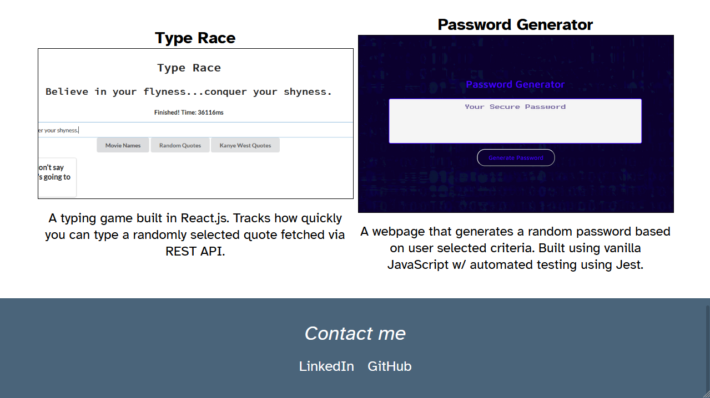

# Portfolio Example
An example of a basic responsive portfolio website using only HTML and CSS.

# Features
- Responsive w / mobile first design
- CSS animations
- Skip / jump links
- Project samples

### Technologies used
- HTML5
- CSS3
- GitHub Pages

# Screenshots

## Default view (Galaxy Fold emulation)

## Default view (Galaxy Fold emulation)

## Default view (Galaxy Fold emulation)

## Default view (Galaxy Fold emulation)

## Default view (Galaxy Fold emulation)

## Default view (Galaxy Fold emulation)

## Default view (Galaxy Fold emulation)

