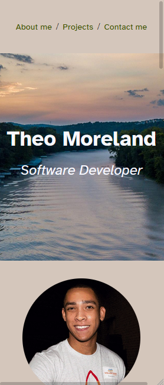

# Portfolio Example
An example of a basic, responsive portfolio website using only HTML and CSS.

# Features
- Responsive w / mobile first design
- CSS animations
- Skip / jump links
- Project samples

### Technologies used
- HTML5
- CSS3
- GitHub Pages

# Future improvements
* Add section(s) to display skill-set and/or certifications

# Screenshots

## Default view (Galaxy Fold emulation)

## Default view

## About me section

## Work section #1

## Work section #2

## Contact me section

