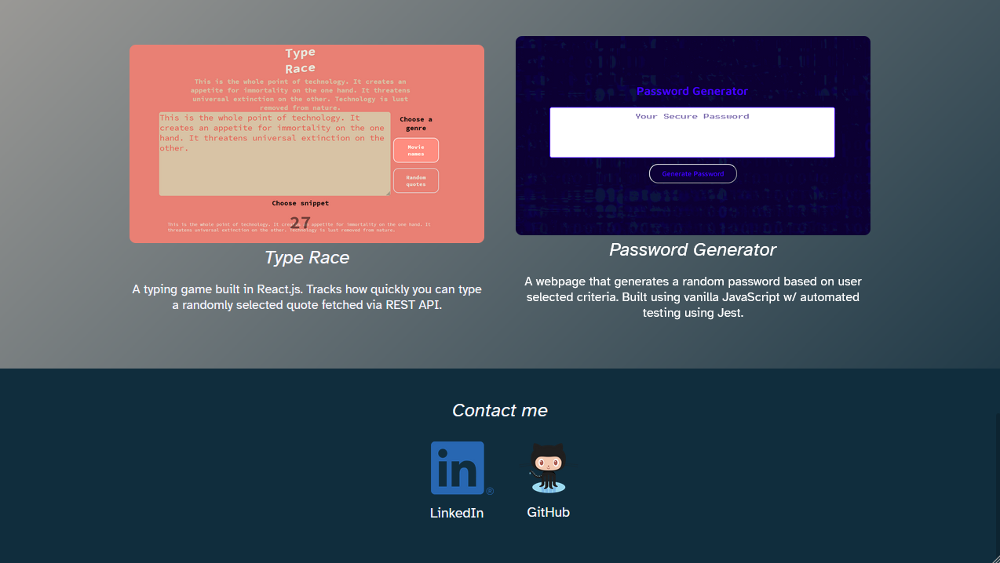

# Portfolio Example

An example of a rudimentary, responsive portfolio website using only HTML and CSS. This is not my actual portfolio, it was intended to function as an example for students of SMU's FSF course (2021).

_Note: This project was an assignment for Southern Methodist University's Full Stack Flex bootcamp (2021)._

### Technologies used

- HTML5
- CSS3
- GitHub Pages

# Screenshots

## Default view (Galaxy Fold emulation)

## Default view

## About me section

## Work section #1

## Work section #2

## Contact me section

